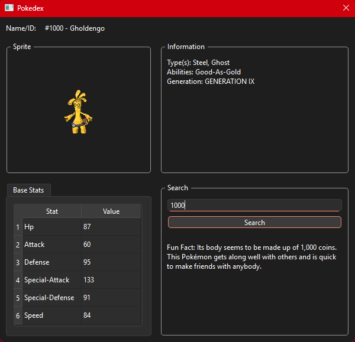

# Pokédex CLI
  

**Pokédex CLI** a Python-based command-line tool that retrieves and displays detailed information about Pokémon using data from the [PokéAPI](https://pokeapi.co/). The application supports queries by both name and ID, returning a readable output in the terminal.

**DexUI**: A User Interface (UI) created using logic from app.py

---

## Features

* Search for Pokémon by name or ID
* Display types, abilities, base stats, and generation
* Show sprite image URL
* Include official flavor text (fun fact)

---

## Installation

### Prerequisites

* Python 3.12.4
* `pip` (Python package installer)

### Setup Instructions

**Clone the repository**

   ```bash
   git clone https://github.com/anthony-hackman/pokedex_cli.git
   cd pokedex_cli
   ```


**Install dependencies**

   ```bash
   pip install -r requirements.txt
   ```

---

## Usage

Run the application with a Pokémon name or ID:

```bash
python app.py <name_or_id>
```

### Examples

```bash
python app.py charizard
```

```bash
python app.py 6
```

---

## Sample Output

```text
─────────────────────────────── #6 - Charizard ────────────────────────────────
Sprite: https://raw.githubusercontent.com/PokeAPI/sprites/master/sprites/pokemon/6.png
Type(s): Fire, Flying
Abilities: Blaze, Solar-Power
Introduced in: GENERATION I
Fun Fact: Spits fire that is hot enough to melt boulders. Known to cause forest fires unintentionally.

        Base Stats
┏━━━━━━━━━━━━━━━━━┳━━━━━━━┓
┃ Stat            ┃ Value ┃
┡━━━━━━━━━━━━━━━━━╇━━━━━━━┩
│ Hp              │    78 │
│ Attack          │    84 │
│ Defense         │    78 │
│ Special-Attack  │   109 │
│ Special-Defense │    85 │
│ Speed           │   100 │
└─────────────────┴───────┘
```

---

## Contributing

Contributions are welcome! Feel free to open issues or submit pull requests:

1. Fork the repository.
2. Create a new branch: `git checkout -b feature/my-feature`
3. Commit your changes: `git commit -am 'Add new feature'`
4. Push to the branch: `git push origin feature/my-feature`
5. Open a pull request.

---

## Tests

*No tests available yet.*

---

## License

This project is open-source and available under the [MIT License](LICENSE).

---

## Acknowledgements

* [PokéAPI](https://pokeapi.co/) Created by Paul Hallett and other PokéAPI contributors around the world.
* [Pokémondb](https://pokemondb.net/) Database, 2008-2025.
* [Pokémon](https://www.pokemon.com/) Images & Names © 1995-2025 Nintendo/Game Freak.
  
